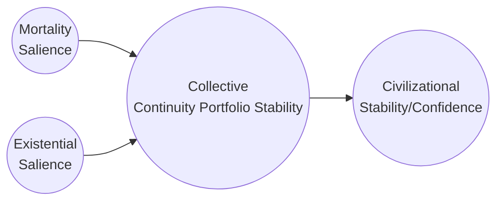

# Executive Summary
Human stability hinges on both **survival security** and **meaning security**. We propose splitting *mortality salience* (perceived physical-threat risk) from *existential salience* (perceived meaning/identity-threat risk) and modeling society as a network of **continuity anchors** – the future-oriented roles and beliefs people invest in. Each person’s **continuity portfolio** (family, job, faith, nationality, ideology, etc.) carries weights that shift over life. Societal destabilization rises when these portfolios become concentrated or cross-cut by antagonistic anchors and when shocks hit multiple high-weight anchors simultaneously. 

To make this operational at scale, we define a **latent “stability” state** (civilizational threat load or collective continuity confidence) driven by observable indicators. High *mortality salience* (war, pandemic, crime, economic insecurity) and high *existential salience* (cultural displacement, status loss narratives, ideological conflict) both erode *cooperative capacity*. Indicators include horizon compression (short-termism in investment, fertility, migration), rising polarization measures, trust decay, and proliferation of threat-themed narratives. Historical cases (e.g. post-2008 financial crisis, pandemic- or war-spurred unrest) show that declines in these composite indicators often precede conflict, populism, or economic collapse. 

For the purpose of illustration, we sketch a state-space model where physical and symbolic threat inputs feed into a latent stability index. Formally, individual fragility might be modeled as: 

\[
F_i \;=\; \sum_{j=1}^J b_{ij} \Bigl( x_{ij} \;-\; \bigl[t_j^{(m)} + t_j^{(e)}\bigr]\Bigr)\,. 
\]

where b_{ij} are person i’s weights on anchors j, T_j denotes a threat salience (comprising both mortality, existential, or both). Population stability is then an aggregate of individuals' continuity profiles at a population scale. This allows explicit modeling of societal impacts of anchor loss on a national level (e.g. economic insecurity, declining religiousity, etc.). And helps to simulate second order effects of policy shifts. Long term accumulation of successful reasearch even has potential to yield a **civilizational cost function**: e.g.

C = \alpha \,\mathrm{Var}(F_i) + \beta\,\mathrm{Cov}(F_i,F_{i'}) + \gamma\,E[F_i],  

or a more sophisticated factor model, calibrated by episodes of unrest.  

We identify candidate metrics: survey items (World Values Survey, Gallup Trust, Eurobarometer), administrative data (migration, intermarriage rates, bond markets, insurance premiums, education completion), market signals (long-term bond yields, sovereign spreads, venture funding horizons), and social-media sentiment analyses (topic intensity of threat, polarization indices). These feed into composite indices for **anchor exposure** (e.g. percent of population depending on X), **anchor concentration** (e.g. Gini of identity reliance or percent with single-anchor portfolios), **anchor covariance/antagonism** (cross-group trust gaps, hate crime rates, affective polarization), **time-horizon metrics** (R&D spending share, average planning horizon, loan terms), **trust-institutions** (survey trust scores, tax morale proxies), and **narrative diffusion** (frequency of existential keywords in media). We will present a table of specific indicators vs. data source, frequency, and noise level.  

Causally, we can test this framework via natural experiments: e.g. compare regions hit by sudden shocks (pandemics, natural disasters, terrorism) using diff-in-diff or synthetic controls to see if our composite index predicts subsequent unrest or policy failure; use instrumental variables (e.g. distance from conflict zones) to isolate threat perception effects; and panel methods to see if indicator shifts precede conflict onset. Validation comes from back-testing: e.g. check if spikes in our **stability index** occurred before the Arab Spring, Eurozone crisis, or recent populist waves.  

Policy levers then aim to *diversify and legitimize anchors* while dampening correlated shocks. Examples include universal healthcare (reduces mortality anxiety), housing security (anchors family), civic education and inclusive narratives (legitimize multiple identities), progressive taxation and corporate purpose regulation (limit predatory anchors like unchecked “maximize shareholder value” mechanics from externalizing costs), and multilateral security commitments (reducing geopolitical threat). Evaluation should track whether interventions increase our stability index. To mitigate Goodhart effects, we rotate proxy indicators and embed qualitative oversight. We also propose governance innovations like an independent **Stability Council** to monitor sentinel signals. 

The following sections flesh out these concepts, models, and data in detail.

## Key Definitions  

- **Mortality Salience:** The *perceived likelihood of personal survival threat* (e.g. violence, pandemic, disaster, increased physical threats from economic collapse) within an actionable horizon. Triggers cognitive risk-response shifts (shortened time preference, demand for security). At population scale, measured by metrics like violence rates, pandemic worry, unemployment, and climate risk exposure.  

- **Existential Salience:** The *perceived risk to identity-meaning systems or symbolic continuity*. This covers fears of cultural displacement, status loss, meaninglessness, or future irrelevance. Though intangible, it manifests as increased polarization, ideologically-driven anger, or spiritual anxiety. For example, large youth surveys report global “eco-anxiety” driven by the sense that governments fail existentially.  

- **Threat Salience:** The accumulated *threat perception* induced in an individual from *Mortality and Existential Salience*.

- **Identity Anchor / Immortality Project:** Any *role, project, or belief that people invest in to give their lives a future-oriented purpose or meaning*. Examples: family, profession, religion, community, nation, ideology, or legacy projects. Each anchor has an *exposure coefficient* to mortality and existential threat (e.g. a fragile job is high mortality-risk; a contested national identity is high existential-risk). Anchors may overlap or conflict between individuals.  

- **Continuity Portfolio:** Each individual’s **vector of anchors and their weights** (how much identity or future investment they have in each). Weights evolve over life (e.g. youth emphasize education, mid-life family or career, elders legacy). Diversity in the portfolio (many medium-weight anchors) confers resilience both to any single anchor loss and to mitigate threat salience ; concentration (one mega-anchor) yields efficiency but high fragility. 

- **Continuity Fragility:** A scalar measure for an individual’s vulnerability. It combines high average threat exposure (weighted sum across anchor risks), high concentration (uneven weight distribution in one anchor), and high covariance among the anchor risks. E.g. if one loses a heavily weighted anchor to threat, overall fragility spikes.  

- **Civilizational Threat Load / Collective Continuity Confidence:** The **aggregate latent state** we aim to track. Think of it as an economy’s “output gap” but for societal stability: low threat load (high confidence) means high cooperation and long-term planning; high threat load means stress, polarization, short-termism. Ideally this is one or a few latent factors extracted via dynamic factor analysis or state-space models from all indicators.  

## Conceptual Model  

We can represent society’s state with a two-channel latent model (physical vs symbolic) feeding into a cooperation capacity or stability index. For instance:  

- *MortalitySalience* and *ExistentialSalience* are exogenous shock inputs (wars, disasters, ideological shifts).  
- *ContinuityPortfolio* (a latent aggregation of individual portfolios) mediates their effect – e.g. heavy combined exposure and correlation raise fragility.  
- The final node *CivilizationalStability* is the outcome we want to maximize (analogous to “output” in a control system).  

The real model would be a state-space system or dynamic factor model:  

z_t = A z_{t-1} + B u_t + \epsilon_t,\quad y_t = C z_t + \eta_t
  
where u_t are observed threat indicators (mortality or existential signals), z_t is the latent stability state, and y_t are our panel of indicators (trust scores, polarization indices, economic horizons, etc.). The parameters A,B,C capture feedbacks and sensitivities. Over time, z_t should predict outcomes like unrest, market volatility, or policy breakdown. 

Alternatively, one can write an *objective function* directly. For each individual i, let w_{ij} be weight on anchor j, and let T_j (mortality channel) and X_j (existential channel) be anchor-specific threat levels. Then a simple fragility for person i might be:  

f_i = \sum_j w_{ij}\,T_j + \sum_j w_{ij}\,X_j + \lambda\,\sum_{j,k}w_{ij}w_{ik}\,\mathrm{Cov}(T_j+X_j,\;T_k+X_k),
  
i.e. baseline exposure plus concentration/covariance penalty. Aggregate civilizational cost could be:  

C = \alpha\,\mathrm{E}[f_i] + \beta\,\mathrm{Var}(f_i) + \gamma\,\sum_{j\neq k} \rho_{jk}^2,
  
where \rho_{jk} reflects the alignment (or conflict) between anchors j,k across the population.  A more tractable approach is to define a “Stability Index” S_t = g(\text{indicators}_t) via factor analysis, and then treat C = -S_t as the cost (to be minimized) for control purposes.

## Indicators & Measurement  

We propose specific indicators for each key component. Data should be as broad and timely as possible, combining surveys, admin data, markets, and media. 

- **Anchor Exposure:** What fraction of people have a significant stake in each anchor?  
  - *Family/Relational:* marriage/fertility rates, multigenerational households, neighborhood ties (social network surveys).  
  - *Economic:* share of income from wage vs capital, % in permanent jobs, union membership.  
  - *Institutional:* % relying on public benefits (health, pensions), civil service size.  
  - *Cultural:* % identify with a faith/community, participation in civic orgs (e.g. faith attendance, NGO membership).  
  - *Ideological:* survey self-reported primary identity (e.g. WVS “most important problem” or identity question).  
  - *Entrepreneurship/Risk:* % in speculative trades, crypto ownership.  
  *Data Sources:* World Values Survey, Gallup World Poll (global identity); national labor/census stats; credit bureau financial profiles; social media profile analysis.

- **Anchor Concentration:** How narrowly focused are people’s portfolios?  
  - *Individual level:* Surveys ask about number of “core domains” (e.g. importance of family, work, religion on 0–10 scale; then measure entropy of those).  
  - *Population level:* Gini or Herfindahl index of anchor reliance (e.g. share of population for whom one anchor is 80% of identity).  
  - *Proxy:* Economic inequality (Gini of income) as a proxy for concentration of material anchor; cultural metrics (e.g. % attending only one church, one party).  
  *Data Sources:* WVS identity questions; General Social Survey (U.S.) or European Social Survey (Europe) for identity multiplicity; IRS or tax records for wealth concentration.

- **Anchor Covariance / Antagonism:** How correlated are anchor displacements, and are anchors mutually destructive?  
  - *Inter-group Polarization:* Affect thermometer gaps (partisan or ethnic affect differences, ANES or Pew surveys); legislative gridlock metrics; segregation indices (residential, schools).  
  - *Hate/Conflict Statistics:* Frequency of hate crimes, domestic terrorism incidents (FBI, OSAC data), protests count, civil unrest indices.  
  - *Opinion Covariance:* In panel surveys, co-movement of attitudes (e.g. those losing job also losing trust).  
  - *Media/Online:* Network analysis of social media communities (e.g. modules of ideological clustering) and prevalence of demonizing rhetoric (topic modeling count of out-group slurs, conspiracy talk).  
  *Data Sources:* Congressional voting rates; social-network data from Twitter (via public APIs) for polarization clusters; Pew/Eurobarometer on immigration attitudes; hate crime databases.

- **Time-Horizon Compression (Mortality Channel Effect):** Measures of short-termism.  
  - *Investment Horizon:* Share of corporate investment in R&D vs cash buybacks; average debt maturity for corporations/governments (Bloomberg data); household savings in short vs long instruments.  
  - *Fertility & Demography:* Drops in fertility rates, marriage rates (a proxy for future-orientation); emigration (giving up long-term stake).  
  - *Education/Training:* Enrollment in extended education programs; dropout rates in universities.  
  - *Financial Behavior:* Credit-card delinquency vs mortgage delinquency, precautionary savings rates.  
  *Data Sources:* BIS global debt statistics; OECD employment & education; country central bank surveys on consumer expectations; Google Trends or survey on “buy gold” or “lottery” as near-term grabs.

- **Institutional Trust & Procedural Exit:**  
  - *Trust Indexes:* Annual surveys of trust in government, media, judiciary, NGOs (e.g. Edelman Trust Barometer【23†L233-L242】, Gallup, WVS “Confidence in institutions” questions).  
  - *Compliance Behaviors:* Tax compliance rates, voter turnout (low trust → apathy), jury duty compliance, contract enforcement delays.  
  - *Shadow Economy:* Size of grey/black market (IMF/World Bank estimates), number of private arbitration/trade blocs.  
  - *Exit Actions:* Emigration rate, opting out of systems (e.g. homeschooling rates vs public schooling).  
  *Data Sources:* OECD trust surveys; World Bank Worldwide Governance Indicators; Transparency International (corruption); Census migration data.

- **Narrative Threat Diffusion:**  
  - *Media Sentiment:* Automated analysis of news/social media for rise in threat-related language (e.g. frequency of “invasion”, “crisis”, “extinction”, “betrayal” terms; or net sentiment of country).  
  - *Social Media Storms:* Trending topics intensity around insecurity topics.  
  - *Surveys of Anxiety:* Explicit questions about personal security or national outlook (e.g. perceived economic insecurity).  
  - *Cultural Products:* Count of “doom” entertainment (e.g. disaster movies, dystopian bestsellers sales as a high-level gauge).  
  *Data Sources:* MediaCloud or GDELT databases; Twitter API for keyword volumes; Google Flu Trends analogies (Google Trends for “air raid siren” spikes?).

The table below summarizes key indicators and data aspects:

| **Indicator**          | **Examples (Data Source)**                 | **Frequency/Coverage** | **Pros/Cons**                           |
| ---------------------- | ------------------------------------------ | ---------------------- | ---------------------------------------- |
| Anchor Exposure        | Employment sector shares (ILO), census identity shares, family size (census) | Annual (some surveys); global (ILO/WVS) | **Signal:** Direct measure of reliance. **Noise:** Self-report bias, infrequent. |
| Anchor Concentration   | Identity entropy from surveys, income Gini (World Bank)            | Annual/irregular       | **Signal:** Captures imbalance. **Noise:** Proxy for others (gini → anchor). |
| Anchor Antagonism      | Polarization index (ANES/Pew), hate crime rates (FBI/OECD), segregation indices | Annual                | **Signal:** Direct conflict gauge. **Noise:** Some latent factors. |
| Horizon Compression    | R&D/capex ratios (UNCTAD), bond curve steepness (Bloomberg), fertility/marriage (UN) | Quarterly/annual       | **Signal:** Good early warning. **Noise:** Can move for non-threat reasons (innovation cycles). |
| Institutional Trust    | WVS/Gallup trust questions, Edelman Barometer       | Annual                | **Signal:** Directly related to discontent【23†L233-L242】. **Noise:** PR spin, survey framing. |
| Procedural Exit        | Emigration rates (World Bank), passport renunciations (gov’t reports) | Yearly/ongoing         | **Signal:** Extreme discontent. **Noise:** Migration has multiple causes. |
| Narrative Threat Diffusion | Topic intensity (MediaCloud), hashtag analysis (Twitter API) | Real-time (weekly)     | **Signal:** Fast, visible. **Noise:** Bots, sensational media bias. |
| Composite Stability Index | Factor models (combine above)           | Derived weekly/monthly | **Signal:** Low-dim overview. **Noise:** Model assumptions.   |

Each candidate should be evaluated for data quality. For example, **WVS trust** question correlates well with behavioral trust (Ponsi et al. 2017)【16†L9-L12】, making it credible. Market data like sovereign CDS spreads can proxy perceived survival risk. Social-media measures can be noisy but tuned (e.g. exclude bots, calibrate against survey shocks).

## Causal Identification & Validation  

To validate causal links and the model’s predictive power, we suggest:  

- **Quasi-Experiments:** Use sudden shock events as natural experiments. E.g. compare changes in our index pre/post-**exogenous** shocks: terrorist attacks, natural disasters, or policy shifts. For instance, assess whether trust and polarization spiked after the 2015 Paris attacks or 2020 pandemic onset, controlling for other factors. A difference-in-difference could use unaffected regions as controls【22†L84-L93】.  

- **Synthetic Controls:** Construct counterfactual stability trajectories for countries hit by crises (e.g. Greece pre-2010 crisis; Ukraine pre-2022). Compare real vs synthetic (weighted average of peers) for incidents of unrest, validating if declines in index align with outcomes.  

- **Instrumental Variables:** Seek exogenous instruments. Example: distance from conflict or refugee border as instrument for trauma exposure, to see how “objective” threat vs perceived relates to behavior (e.g. trust or voting). Use weather/climate shocks (e.g. flood catastrophe intensity) to instrument local mortality salience and test effects on aggression or solidarity.  

- **Panel and Longitudinal:** Analyze panel surveys (e.g. European Social Survey waves) to see if individual-level increases in anxiety predict civic disengagement or scapegoating. Use lagged panel regressions to test if rising indicators predict subsequent unrest (fear Granger-causes conflict).  

- **Back-testing:** Compare historical data: e.g. compute our stability index for the 2007–09 period and see if it fell before Lehman, and for 2019–20 to see if it predicted rise of populist movements, crises of confidence, etc. Look at 20th-century cases (using archival proxies) like 1930s or WWI build-up.  

Robustness requires falsification: check that indices don’t spike arbitrarily in peaceful times, and that they correlate with *destabilizing outcomes* (e.g. revolutions, coups, financial crises) in multiple contexts. Machine learning could help find patterns, but domain constraints (theory) should guide interpretability.

## Policy Toolkit & Governance  

**Key Policy Directions:** Any policy that broadens legitimate anchors or cushions them reduces fragility. This reframes many social policies as *stabilizers*, not just welfare.

- **Economic Security (Mortality Buffering):** Universal healthcare, unemployment insurance, job guarantees. These directly reduce personal death/insecurity anxiety. Empirically, social insurance correlates with longer planning (e.g. higher R&D share in social-democratic countries).  
- **Housing and Family Support:** Affordable housing and childcare anchor families. E.g. in countries with strong family policies (Nordics), population diversity of anchors is high, and stress is lower.  
- **Civic Identity & Participation:** Civic education, inclusive national narratives (recognizing minorities, shared history), and voluntary national service can expand non-partisan anchors. E.g. countries with compulsory service often report higher social trust.  
- **Corporate and Financial Norms:** Regulate “destructive” anchors. For instance, require corporate stakeholders to consider social goals (B-Corp movement); limit excessive CEO pay (prevents wealth as sole anchor). Enforce antitrust to avoid one industry dominating many lives.  
- **Media & Information:** Public broadcasting standards, anti-disinformation efforts reduce divisive narratives. Investment in public spaces (libraries, parks) as neutral anchors.  
- **Multilateral Security Commitments:** Alliances, treaties, and global cooperation reduce geopolitical mortality anxiety. Positive identification with international projects (space programs, climate pacts) can counter isolationism.  

**Example Metrics for Policies:** When evaluating, use the same stability index. If a new housing subsidy is introduced, test its effect via a synthetic control on the local trust/community index. Or simulate scenarios: e.g. could universal basic income move the index upward by how much? 

**Goodhart Mitigations:** As soon as a metric is targeted, it can be gamed. We propose:
- **Rotating Indicator Sets:** Periodically change which proxies feed the index, keeping core meaning but avoiding fixation.  
- **Adversarial Reviews:** Independent audits (from academia or NGOs) to catch gaming.  
- **Qualitative Sentinels:** Include expert assessment panels whose judgment (e.g. a “social stress barometer”) checks if the numeric index is misleading.  
- **Distributed Governance:** Consider a “Continuity Index Board” with stakeholders (government, civil society, international partners) to review and adjust methodology.

**Governance Structure:** This could formalize into a **Civilizational Resilience Office** (analogous to central banks) that monitors stability signals. It would issue quarterly “resilience reports” and advise on trigger interventions. Importantly, cross-sector coordination (economy, defense, education, media) is needed, since no single ministry owns social meaning. 

## Indicators: Detailed Examples  

| **Component** | **Candidate Indicator**                 | **Data Source**                       | **Notes (freq, coverage, reliability)**           |
|--------------|-----------------------------------------|---------------------------------------|-----------------------------------------------|
| *Anchor Exposure (material)* | % workforce in long-term contracts | ILO labor stats (annual)             | Global coverage, but may lag in reporting.  |
|              | Homeownership rate                     | National surveys (yearly census)      | Proxy for family anchor stability.            |
|              | Public benefit recipiency (%)          | Government administrative data       | Often published annually.                     |
| *Anchor Exposure (social)* | % married, average household size      | UN demog. databases (annual)         | Good global data, signals social bonding.     |
|              | Voluntary association membership (per capita) | World Bank/WVS surveys (biannual) | Varies by country, but indicates civic anchor usage. |
| *Concentration* | Identity multiplicity index (survey entropy) | Customized in WVS/ESS (every 5 years) | Would require new survey module; high value if collected. |
|              | Income/wealth Gini                    | World Bank (annual)                  | Indirect; high inequality often correlates with narrow anchor spread. |
| *Covariance* | Correlation of anchor shocks (bankruptcy vs divorce rates) | Admin data (yearly)     | Would require clever matching; high effort but diagnostic. |
|              | Cross-issue ideology correlation       | Election surveys (post-elect)        | E.g. do those upset by economy also hate immigration? Low covariance signals broad coalitions. |
| *Antagonism* | Affective polarization index          | Surveys/ANES (biennial)              | Well-known measure in U.S.; analogous tools exist elsewhere. |
|              | Hate crime incidence per capita       | UNODC/OSCE data (annual)             | Under-reporting is a concern but trends available. |
| *Horizon*    | Share of businesses investing >5 yrs ahead | OECD science & tech stats (annual) | Long R&D projects share as proxy.             |
|              | 30-year mortgage issuance volume      | Financial authorities (quarterly)    | Long-term lending trends.                     |
|              | Sovereign 10y yield (vs 1y yield)    | Financial markets (daily/weekly)      | Inverted yield curve can signal panic (short-term > long-term). |
| *Trust*      | % reporting confidence in gov’t       | Eurobarometer, Pew (annual)          | Standard “trust in parliament, police, press” questions. |
|              | Voter turnout                         | National election data (as occurs)    | Low turnout may signal disengagement (trust collapse). |
| *Exit*       | Annual net migration rate             | World Bank (annual)                  | Emigration can reflect hopelessness at home.  |
|              | Passport renunciations               | Country-specific (annual)            | Small signal but extreme.                     |
| *Narrative*  | Volume of “existential threat” keywords in news | MediaCloud (daily)         | Need natural language processing; can catch early mania. |
|              | Survey % “very worried about society’s future” | Pew/Edelman polls (annual)       | Often asked in broad terms (e.g. “satisfied with country’s direction?”). |

**Data Sources (prioritized):** We highlight global/official sources where possible. WVS, Gallup, Pew, Edelman, World Bank, OECD, UN databases are priorities. For social-media data, academic tools like GDELT, MediaCloud, or access to Twitter/GovTrack data are key. Administrative data (tax filings, passports) may require collaboration with governments. 

## Causal Strategies & Validation (Illustrative Approaches)  

- **Natural Experiments:** *Example*: The 2015 Paris attacks raised French mortality salience. One could compare French vs. similar EU countries on subsequent changes in trust, polarization, and out-group hostility using difference-in-differences (factoring in pre-trends)【22†L84-L93】.  
- **Synthetic Control:** *Example*: To test a policy (say, nationwide guaranteed healthcare in Country A in 2024), build a synthetic Country A from countries that did not, using pre-2024 indicators. Check if Country A’s post-2024 stability index deviates.  
- **Instrumental Variable:** *Example*: Use distance from Russian border as instrument for exposure to Ukraine war uncertainty, to see how local mortality salience affects trust in institutions (controlling for other factors).  
- **Panel Regression:** *Example*: Multi-year panel of survey respondents in Europe could show if individuals who experience local unemployment (mortality channel) are more likely to shift to extremist parties (destabilization).  
- **Machine Learning Early Warning:** Feed a half-decade of quarterly indicators into a classifier (e.g. random forest) to predict onset of “crisis year” (binary label from conflict databases). Check importance of features.  

Each empirical strategy should guard against confounds (e.g. economic shocks cause both anxiety and unrest) by including controls or fixed effects. As with climate early warnings, look for “critical slowing down” or variance increases in leading indicators as alarms【13†L237-L245】.  

Back-testing could involve time-series models: if we build S_t, see how often S_{t-1} spikes  predict R_t events (revolutions, coups, market crashes). Cross-validate on different regions/eras. The **goal** is not perfect prediction, but showing directional validity: higher threat load precedes instability more often than by chance.  

## Governance & Goodhart Mitigation  

We recommend a **continuity stability oversight mechanism** with these features: 

- **Indicator Panel:** A dashboard of rotating indicators (mix of quantitative and qualitative) rather than a single metric.  
- **Independent Analysis:** An expert unit (analogous to a Fed research department) to analyze data trends and challenge assumptions.  
- **Scenario Exercises:** Regular resilience drills (as many governments do for cybersecurity) to test responses if indicators cross thresholds.  
- **Stakeholder Forums:** Bring in business, community, and tech leaders to interpret narrative signs (e.g. media focus, social chatter).  

To counter Goodhart’s Law: 
- Never use the raw composite as a performance target for agencies. Instead, link it to broad “social health” objectives (like public well-being indexes) that can’t be easily gamed by single actions.  
- Use shadow indicators (“Canaries in coal mine”) that are hard to fudge (e.g. excess mortality rates, which are less manipulable than survey trust).  

## Summary  

By reframing social stability as a control problem over a latent *continuity/confidence* state, we gain a toolbox: clear definitions, measurable proxies, and a way to evaluate policies by their effect on systemic resilience, not just GDP. The concept of **continuity portfolios** integrates psychological theory (fear of death driving symbolic projects) with socio-economic measurement, enabling interdisciplinary analysis. This yields *decision-grade* intelligence: understand trade-offs (e.g. the productivity boost vs stability cost of deregulating labor markets), model second-order effects (how surveillance tech might raise existential salience), and quantify risks (probability that current threat levels tip into instability). 

Ultimately, reducing destabilization means expanding **collective continuity confidence** – ensuring people feel their lives matter within a stable future. Actions from secure healthcare to inclusive narratives become part of a grand “stability budget.” This report lays the groundwork for that framework.

