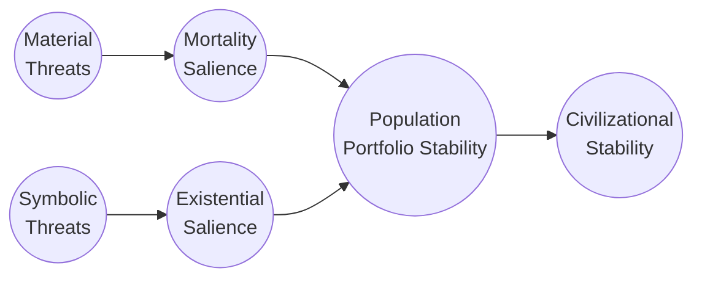

# Central Axioms — Civilizational Stability Framework

---

## A Note on Nomenclature

Three terms carry specific and consistent meanings across all documents in the Framework Foundations layer.

**Threat salience** is the umbrella term for the aggregate experienced state of heightened perception that survival and meaningful life are under threat. When threat salience rises, people shorten their time horizons, harden in-group identity, become hostile toward perceived out-groups, and are drawn toward authoritarian leadership that promises to defend what they feel is at risk.

**Mortality salience** is the material channel of threat salience — the perception that physical survival systems are unreliable or failing. Economic insecurity, housing instability, healthcare inaccessibility, and exposure to violence all raise mortality salience.

**Existential salience** is the symbolic channel — the perception that one's meaning structures, identity anchors, or ways of life are under threat. Cultural attack on anchor communities, political delegitimization of valued beliefs, identity negation, and manufactured threat amplification all raise existential salience. This channel operates independently of material conditions and responds to different reduction strategies.

---

## Executive Summary

Human stability depends on both survival security and meaning security. The framework splits the standard terror management theory construct of mortality salience into two distinct channels — **mortality salience** (perceived physical threat) and **existential salience** (perceived identity and meaning threat) — and models society as a network of **continuity anchors**: the future-oriented roles, relationships, beliefs, and institutions people invest in to give their lives durable purpose.

Each person holds a **continuity portfolio** — a weighted distribution across anchors such as family, work, faith, community, and civic identity. The distribution of that portfolio matters as much as its content. A person whose entire meaning rests on a single anchor is maximally fragile when that anchor is threatened, regardless of how strong the anchor is in baseline conditions.

Societal destabilization rises when portfolios become concentrated (few high-weight anchors), when multiple anchors are threatened simultaneously through correlated shocks, and when the political and information environment frames different anchor communities as being in active zero-sum competition. Historical cases — the post-2008 financial crisis, pandemic-era unrest, the populist waves of the 2010s — consistently show that fragility concentrated in specific population segments, combined with correlated anchor shock, precedes political breakdown.

The framework proposes a measurement approach grounded in observable indicators: survey-based trust and identity data, administrative data on economic stability and mobility, market signals for time horizon compression, and media and network analysis for narrative threat diffusion. These feed into a composite stability picture that allows policy evaluation beyond GDP — tracking whether interventions actually improve the conditions that sustain cooperative, long-horizon democratic engagement.

Policy instruments are evaluated against their ability to diversify anchor portfolios, reduce material and symbolic threat loads, extend decision time horizons, and reduce antagonism between anchor communities — without improving one dimension by worsening another.

---

## Key Definitions

**Mortality salience** — the perceived likelihood of physical threat to survival or material security, arising from violence, economic collapse, health crisis, housing instability, or infrastructure failure. This is the channel that TMT's experimental paradigm primarily activates. It raises the background activation of existential defense mechanisms: worldview hardening, time horizon compression, in-group/out-group polarization, and demand for strong central authority.

**Existential salience** — the perceived risk to identity, meaning, and symbolic continuity, arising from cultural displacement, status loss, institutional illegitimacy, or sustained attack on the anchor classes through which people derive meaning. Though less tangible than mortality salience, it produces the same behavioral profile and can rise entirely independently of material conditions through political and media amplification.

**Threat salience** — the composite perception arising from both channels. The framework treats threat salience as the primary variable of interest at the population level: elevated threat salience is the condition that most reliably predicts democratic erosion, capital volatility, political radicalization, and conflict escalation.

**Continuity anchor** — any role, project, relationship, institution, or belief through which a person invests in future-oriented purpose and meaning. Examples include family relationships, professional identity, religious community, neighborhood belonging, civic participation, national identity, and creative or intellectual legacy projects. Anchors are not abstract preferences — they are the structures through which people decide whether to cooperate, plan ahead, and maintain the prosocial behaviors that democratic stability depends on.

**Anchor dimensions** — the categories of human need that anchors service. Four principal dimensions account for most of the structure in how people organize their meaning portfolios: community and belonging (the felt experience of being known within a specific group); meaning and transcendence (locating oneself within something larger — religious, philosophical, or civilizational); contribution and work (the need to be useful and to participate in a shared economy of effort); and family and intimate bonds (the irreplaceable relationships of deep personal attachment). A single anchor — most visibly a strong religious community — can simultaneously service multiple dimensions, which makes it both more powerful as a stabilizing force and more dangerous as a concentrated vulnerability when threatened.

**Anchor classes** — groupings of specific anchors that share a vulnerability profile, failing through similar mechanisms and susceptible to the same categories of shock. Religious institutions form one class; workplace and professional anchors form another; neighborhood and place-based community anchors a third. This matters because class-level threats — a broad economic recession, a sustained cultural attack on religious institutions — hit all anchors within the class simultaneously, producing correlated shocks that are far more destabilizing than idiosyncratic anchor failure. A person whose community dimension runs entirely through religious community loses it differently than a person whose community runs through both religious community and a neighborhood civic association, even if both nominally hold community anchors.

**Continuity portfolio** — each individual's weighted distribution across anchors. The weights reflect how much of that person's identity and future investment flows through each anchor. In the neutral case, weights sum to one — each anchor carries a share of the meaning portfolio. Negative weights are possible when an anchor is present in a person's environment but actively conflicts with their identity, subtracting from rather than contributing to stability. Portfolio concentration — the degree to which weights are dominated by a single anchor or class — is the primary structural predictor of fragility under threat.

**Continuity fragility** — the degree to which a person's stability score is vulnerable to disruption. It rises with anchor concentration, with the threat load on heavily-weighted anchors, and with correlated threat exposure across multiple anchors of the same class. A highly concentrated portfolio exposed to a class-level shock is the highest-fragility configuration the model identifies, and it is associated with the most acute version of the radicalization behavioral profile.

**Anchor antagonism** — the degree to which anchors held by different population segments are framed or experienced as mutually exclusive or in zero-sum competition. Antagonism rises not only when anchors are genuinely incompatible but when the political or information environment treats a gain for one anchor community as requiring a loss for another. High antagonism is the third dimension of population-level instability, operating independently of average stability and distributional inequality.

---

## Conceptual Model

Society's stability state can be represented as a two-channel system in which material threats produce mortality salience and symbolic threats produce existential salience, both feeding into the aggregate continuity portfolio stability of the population, which in turn determines cooperative capacity and long-horizon democratic engagement.

The key structural properties of this model:

Material threats and symbolic threats are distinct inputs requiring distinct policy responses. Improving material conditions does not automatically reduce existential salience, and vice versa — the two channels must be addressed separately and their interaction managed jointly.

The continuity portfolio is the primary mediator. The same objective threat level produces different population-level consequences depending on how concentrated portfolios are, how much correlated class-level exposure exists, and how much antagonism has been activated between anchor communities.

Civilizational stability is the outcome — not GDP growth or aggregate welfare in the standard sense, but the degree to which the population maintains the long time horizons, institutional trust, and cooperative capacity that democratic governance and productive economic activity require.

The formal specification of the individual stability score, the anchor dimension and class framework, and the population-level stability dimensions are developed in detail in the Model Definitions document. The present document establishes the conceptual foundations and the measurement architecture.

---

## Three Dimensions of Population-Level Stability

Rather than aggregating individual stability into a single composite function, the framework characterizes the population distribution of continuity scores along three dimensions that capture distinct risks and respond to different interventions.

**Average stability** — how well the population's meaning environment is supporting the average person's capacity to invest in a livable future. Low average stability means the population is, on balance, operating under elevated threat — a condition associated with shortened political time horizons, demand for strong central authority, and capital volatility. Policies that reduce the material and symbolic threat load on broadly held anchor classes improve this dimension.

**Inequality of stability** — the dispersion of stability across population segments. High dispersion means some groups are operating near collapse while others are stable — a configuration that generates resentment, perceived unfairness, and the grievance politics that accompany it. Even when average stability is moderate, high dispersion predicts political fragmentation, because the people experiencing the lowest stability are the most available to radicalization and the least able to engage in deliberative political participation. Policies that expand anchor access and reduce concentrated threat load improve this dimension.

**Anchor antagonism** — the degree to which anchor communities are in active perceived competition. This dimension can move independently of the other two: a society with moderate average stability and low dispersion can still be highly antagonistic if the political environment has successfully framed different anchor communities as existential threats to each other. Reducing antagonism requires settlement of specific anchor conflicts, removal of institutional incentives for threat amplification, and the physical and social conditions for cross-anchor familiarity formation.

The dangerous configurations are those in which all three dimensions are simultaneously adverse: low average stability, high dispersion, and high antagonism. These configurations are self-reinforcing — low average stability makes people more susceptible to antagonism amplification; high dispersion creates the resentment that antagonism feeds on; high antagonism prevents the cooperative problem-solving that would address the material conditions driving low stability.

---

## Indicators and Measurement

The framework proposes a measurement architecture grounded in observable indicators across six categories. The goal is not a single composite score that can be optimized or gamed, but a panel of indicators that together provide a rich, multi-dimensional picture of the population's stability state — and that are resistant to any single intervention gaming them all simultaneously.

**Anchor exposure** — what fraction of people have significant stakes in each anchor type, and how those stakes are distributed.

- Family and relational: marriage rates, fertility rates, multigenerational household prevalence, neighborhood social network density
- Economic: share of income from stable employment vs. precarious or speculative sources, union membership, long-term contract prevalence
- Cultural and civic: religious attendance and participation, civic organization membership, voluntary association density
- Institutional: reliance on public systems (healthcare, pension, education) as a measure of institutional anchor stakes

*Primary sources*: World Values Survey, Gallup World Poll, national census and labor statistics, administrative records

**Anchor concentration** — how narrowly focused portfolios are at the individual and population level.

- Individual level: survey-based measurement of the number of domains to which people assign high identity importance, expressed as an entropy or Herfindahl index of identity reliance
- Population level: the share of the population for whom a single anchor type dominates — a concentration measure that identifies the segments most structurally vulnerable to class-level shocks
- Proxy measures: economic inequality (Gini) as a partial proxy for material anchor concentration; single-party or single-institution affiliation rates

*Primary sources*: WVS identity questions, General Social Survey, European Social Survey, national wealth surveys

**Anchor antagonism** — the degree to which different anchor communities perceive each other as threats.

- Affective polarization: partisan and inter-group affect thermometer gaps, measuring emotional hostility between anchor communities independent of policy disagreement
- Behavioral conflict: hate crime incidence, domestic unrest events, residential and institutional segregation
- Narrative antagonism: social media network clustering by ideological community, prevalence of out-group demonization in high-reach media content, cross-community exposure rates in recommendation environments

*Primary sources*: ANES, Pew Research, ACLED event data, FBI hate crime statistics, computational media analysis through GDELT and MediaCloud

**Time horizon compression** — the behavioral signature of elevated threat salience across both channels.

- Investment horizons: share of corporate capital in R&D versus buybacks, average government and corporate debt maturity, household savings in long- versus short-horizon instruments
- Demographic signals: fertility rates, marriage rates, emigration rates — all of which decline when populations perceive the future as not reliably accessible
- Financial behavior: credit delinquency patterns, precautionary savings rates, near-term consumption versus long-term investment ratios

*Primary sources*: BIS global debt statistics, OECD employment and education data, central bank consumer expectation surveys, UN demographic data

**Institutional trust and procedural legitimacy** — the degree to which people perceive institutions as reliable, fair, and worth engaging with.

- Trust surveys: confidence in government, judiciary, media, and public institutions (Edelman Trust Barometer, Gallup, WVS)
- Behavioral compliance: voter turnout, tax compliance rates, civic participation — all behavioral expressions of institutional trust rather than survey expressions
- Exit behaviors: emigration rates, homeschooling rates, private arbitration preference — signals of institutional trust collapse expressed through behavioral withdrawal

*Primary sources*: Edelman Trust Barometer, WVS confidence in institutions module, national tax authority compliance data, World Bank Worldwide Governance Indicators

**Narrative threat diffusion** — the rate and intensity at which threat narratives are spreading through the information environment.

- Media sentiment: automated analysis of news and social media for frequency and intensity of threat-themed language, tracking rises in terms associated with invasion, crisis, extinction, betrayal, and displacement
- Social media dynamics: trending topic intensity around existential threat topics, network propagation speed of high-arousal political content
- Survey anxiety: explicit questions about personal security, national trajectory, and perceived existential threat to valued ways of life

*Primary sources*: MediaCloud, GDELT, platform-specific API data where available, Pew and Edelman longitudinal surveys

The table below summarizes the indicator architecture:

| Component | Example Indicators | Sources | Signal Strengths and Limitations |
|---|---|---|---|
| Anchor exposure | Employment contract type, religious attendance, civic org membership | ILO, WVS, census | Direct measure of reliance; self-report bias, infrequent |
| Anchor concentration | Identity entropy surveys, income Gini | WVS, GSS, World Bank | Captures imbalance; economic Gini is an imperfect proxy |
| Anchor antagonism | Affect thermometer gaps, hate crime rates, media network clustering | ANES, Pew, FBI, GDELT | Direct conflict gauge; hate crime under-reporting |
| Horizon compression | R&D/capex ratios, bond curve steepness, fertility rates | UNCTAD, Bloomberg, UN | Good early warning; can move for non-threat reasons |
| Institutional trust | WVS/Gallup trust questions, voter turnout, tax compliance | WVS, Edelman, OECD | Directly related to discontent; susceptible to survey framing |
| Narrative threat diffusion | Keyword intensity, social media propagation, anxiety surveys | MediaCloud, Pew | Fast and visible; bot contamination, sensational media bias |

---

## Causal Identification and Validation

Establishing causal relationships between threat conditions, continuity portfolio disruption, and downstream political and economic instability requires methodological care. The framework proposes four complementary strategies.

**Natural experiments and quasi-experimental designs** — using sudden exogenous shocks as identification opportunities. Terrorist attacks, natural disasters, pandemics, and abrupt policy shifts provide variation in threat conditions that is plausibly independent of the outcome variables of interest. Difference-in-differences designs comparing affected and unaffected regions, or pre- and post-shock periods with appropriate control groups, can identify causal effects on trust, polarization, and political behavior.

**Synthetic controls** — constructing counterfactual stability trajectories for societies experiencing crises by weighting combinations of peers that did not. Comparing Greece before and after the 2010 debt crisis, or Ukraine before and after the 2022 invasion, against synthetic counterfactuals tests whether the framework's indicators predicted the downstream instability before it became visible in conventional political outcomes.

**Instrumental variables** — seeking exogenous instruments for threat perception. Geographic distance from conflict zones instruments for trauma exposure; weather and climate shocks instrument for local mortality salience; variations in media market structure instrument for narrative threat diffusion exposure. These allow isolation of the causal effect of perceived threat from the confounding effects of the underlying conditions that produce it.

**Panel and longitudinal analysis** — tracking individual-level changes in anchor conditions, threat perception, and political behavior over time. Panel surveys like the European Social Survey, the ANES, and the WVS allow within-person analysis of whether changes in anchor stability predict subsequent changes in political behavior, institutional trust, and civic participation.

Back-testing against historical cases — the 1930s political destabilization, the post-2008 financial crisis, the populist waves of the 2010s — provides additional validation that the framework's indicators, had they been measured, would have predicted the instability that followed. The goal is not perfect prediction but directional validity: the framework should show that higher threat load reliably precedes instability more often than chance, across diverse historical contexts.

---

## Governance and Measurement Integrity

The measurement architecture is subject to Goodhart's Law: as soon as specific indicators become performance targets, they become susceptible to gaming. The framework proposes four structural safeguards.

**Rotating indicator sets** — periodically updating which proxies feed the composite stability picture, keeping the underlying theoretical constructs stable while preventing fixation on any specific measure. No single indicator should remain a fixed target long enough to be systematically gamed.

**Independent analysis** — housing the measurement function in an institution structurally separated from the policy agencies whose performance it evaluates. The Department of Data and Accountability architecture provides the institutional design for this separation, analogous to the independence of central bank research from monetary policy decisions.

**Qualitative sentinels** — supplementing quantitative indicators with structured expert judgment panels whose assessments check whether the numeric picture is capturing what is actually happening on the ground. These panels serve as an early warning system for indicator drift and model failure.

**Scenario and stress testing** — regular exercises testing how the indicator system performs under hypothetical shock conditions, identifying which indicators become uninformative or misleading under specific threat configurations before those configurations occur in practice.

The goal of the measurement architecture is not to produce a single authoritative stability score that can be optimized. It is to produce a rich, multi-dimensional, adversarially validated picture of the population's stability state that is informative to policymakers, resistant to gaming, and honest about its own limitations.

---

## Policy Toolkit

Any policy that broadens the credible availability of anchors, reduces material or symbolic threat loads, extends decision time horizons, or reduces antagonism between anchor communities contributes to civilizational stability. The framework reframes many conventional social policies as stabilizers in this sense — not only as welfare provisions or economic interventions but as direct investments in the continuity portfolio infrastructure that democratic governance depends on.

Illustrative categories:

**Economic security and material stability** — universal healthcare, housing access, counter-cyclical employment support, and long-term savings architecture directly reduce mortality salience by stabilizing the material systems that produce it. The policy design criterion is predictability and stability as much as absolute level: reliable moderate access reduces mortality salience more effectively than volatile high access.

**Anchor diversification and civic infrastructure** — prestige architecture redesign, national civic service, community infrastructure investment, and international mobility programs expand the range of credible meaning pathways available across the population. The design criterion is genuine availability — anchors that are nominally possible but structurally inaccessible to specific populations do not diversify those populations' portfolios.

**Institutional legitimacy and transparency** — verifiable performance measurement, independent accountability institutions, transparent governance, and demonstrated competence through working infrastructure reduce existential salience by providing the shared reference points that anchor institutional trust.

**Settlement of active anchor conflicts** — culture war settlement frameworks, electoral reform that removes institutional incentives for threat amplification, and epistemic infrastructure that makes manufactured threat visible all directly reduce anchor antagonism by removing or neutralizing the political and information environment mechanisms that sustain it.

**Multilateral and international stability architecture** — alliance redundancy, regional security institutions, multilateral dispute resolution, and international mobility programs reduce the geopolitical threat salience that elevates mortality and existential salience simultaneously for large population segments.

Policy evaluation should track effects across all three population-level stability dimensions simultaneously. An intervention that improves average stability while worsening distributional inequality, or that reduces material threat while raising symbolic threat for a different anchor community, has not improved overall stability — it has redistributed instability. The framework's measurement architecture is designed to make these cross-dimensional effects visible.

---

*This document is a foundational axiom document in the Framework Foundations layer. It establishes the theoretical and measurement architecture that the operational domain stacks are designed against. The formal model is specified in the Model Definitions document. The constructive theory of how threat salience is reduced through specific mechanisms is developed in the Threat Salience Reduction Theory. The applied companion for policy practitioners is the Political Salience Management brief.*
