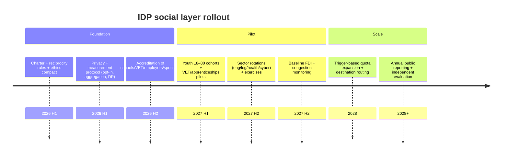

# Social Layer Brief for an IDP Alliance Built Around Familiarity Density

## Executive summary

This brief defines **familiarity density** as an alliance-relevant stock of durable cross-border interpersonal and institutional ties across partner populations (friends, colleagues, classmates, alumni networks, professional communities, and diaspora-linked relationships), distinct from simple mobility volume. The objective is to raise the probability that, under stress, publics interpret partners as “us” rather than “them,” increasing resilience of commitments to cooperation and mutual defense. The binding constraint is political: the social layer must be governable and legible as bounded, reciprocal, and pro-stability—not a covert migration expansion—while still large enough to measurably shift network structure over time.

The evidence base supports prioritizing **structured, repeated, institution-backed contact** over tourist throughput. Meta-analytic work in intergroup contact research finds contact is reliably associated with reduced prejudice across many contexts, with mechanisms consistent with anxiety reduction and empathy/perspective-taking, and with stronger effects in more rigorous studies (Pettigrew & Tropp, 2006; Pettigrew & Tropp, 2008). However, causal inference is fragile in networked social settings (selection, homophily, and influence), so program design must treat evaluation design as a first-order requirement, not an afterthought.

The recommended architecture is a portfolio with explicit reciprocity, capacity management, and measurement: a reciprocal youth mobility track (18–30) tied to schools and universities, a study-and-apprenticeship exchange track tied to accredited institutions, and sector rotations (engineering, logistics, healthcare, cyber, and trades/apprenticeships) that form “deployment-adjacent” professional communities. Mobility is geographically load-balanced via incentives and, where necessary, transparent pricing/permits in congested destinations, combined with compensating local infrastructure investment. The measurement system targets familiarity depth and persistence using privacy-preserving survey, administrative, and aggregate network indicators.

## Evidence base and durability mechanism

Intergroup contact research provides the core micro-mechanism: repeated, cooperative contact under institutional support reduces prejudice on average and tends to operate through reduced anxiety and increased empathy/perspective-taking (Pettigrew & Tropp, 2006; Pettigrew & Tropp, 2008). That mechanism is directly relevant to alliance politics because it alters how citizens categorize partner populations and interpret partner needs and costs.

At the macro level, “security community” theory treats durable cooperation as rooted in dense cross-border transactions, mutual responsiveness, and “we-feeling,” not only elite agreements (Deutsch et al., 1957). From this perspective, familiarity density is a causal input into alliance durability insofar as it creates distributed social references that stabilize legitimacy during political shocks (elections, crises, disinformation, or economic contractions).

Intermarriage and diaspora networks amplify durability by converting exchange into long-horizon kinship and community linkages that persist beyond program cycles. Exchange evaluations (e.g., Erasmus impact materials) highlight that mobility can generate deep cross-national partnering, and diaspora scholarship argues transnational communities can become politically salient actors shaping policy toward homelands and hostlands (European Commission, 2014; Shain, 1995). This implies both opportunity (durable constituencies) and governance risk (politicization), which should be anticipated.

## Policy architecture for mobility and visas

The design objective is to maximize durable tie formation per unit of political and administrative cost. The recommended default posture is **bounded reciprocity**: symmetrical opportunity sets, transparent caps or capacity planning, time-limited stays, narrow settlement pathways (if any), and visible enforcement and reporting. Political economy research indicates immigration attitudes are often shaped by sociotropic concerns about national-level cultural and economic impacts, so credible bounds and reciprocity are not cosmetic—they are feasibility conditions (Hainmueller & Hopkins, 2014).

A practical IDP mobility portfolio can be expressed as three visa templates:

Template A is a **reciprocal youth mobility visa** (18–30; optionally 18–35 by partner) with open work authorization and tight boundaries (no dependents, no default settlement route, proof of funds/insurance, defined duration). A policy archetype here is the UK Youth Mobility Scheme design pattern (bounded duration; no dependants; explicit non-settlement framing), and the Canadian IEC evaluation illustrates the governance reality that reciprocity and monitoring require data-sharing and correction mechanisms when participation is asymmetrical (Government of the United Kingdom, 2016; IRCC, 2019).

Template B is a **study-and-apprenticeship exchange visa** linked to accredited institutions (universities, technical schools, and employers with apprenticeship programs), structured cohorts, and joint outputs. This is the highest “familiarity density per participant” track because institutional scaffolding increases contact quality and repeat interaction. It should explicitly include trades/apprenticeships to avoid concentrating familiarity in elite educational strata, and it should incorporate mutual recognition of modular competencies and safety standards as an incremental alternative to full licensing harmonization.

Template C is a **sector rotation visa** (3–18 months) for deployment-adjacent roles, designed as rotation rather than open-ended labor substitution: pre-departure training, supervised placements, reciprocity by specialty, and (in sensitive sectors) return expectations or reintegration support. This template should incorporate debiasing safeguards such as salary parity rules, transparent reporting, and guardrails against displacement narratives.

## Load-balancing away from over-touristed areas

Overtourism is highly localized: pressure concentrates by neighborhood, season, and destination type, so viability requires managing congestion rather than maximizing footfall. UN Tourism’s overtourism synthesis frames practical strategies such as dispersal within and beyond cities, time-based dispersal, new itineraries/attractions, regulatory adaptation, and infrastructure improvements aligned to local capacity (UN Tourism, 2018). This logic is directly applicable to a social layer because unmanaged congestion can translate quickly into resident backlash and alliance delegitimization.

The IDP approach should treat geography as a policy parameter. Default placements for youth, apprenticeships, and many sector rotations should be in **secondary cities and priority regions** (industrial regions, logistics nodes, and educational hubs), supported by stipend gradients and housing guarantees. Where participation in high-pressure destinations is needed (e.g., specialized hospitals or cyber hubs), use transparent congestion pricing or permit systems, tied to reinvestment in local services and housing, with published exemptions and predictable rules. The goal is to make “familiarity density” politically additive in host communities rather than extractive.

## Sector-targeted mobility for engineering, logistics, healthcare, cyber, and trades

Sector mobility is where familiarity density becomes operational: cross-border professional trust networks reduce coordination cost during shocks. The portfolio should build pipelines with credential scaffolding, joint training, and deployment-ready rotations.

Engineering mobility should leverage accreditation-based mutual recognition to reduce credential friction and accelerate safe placement. The Washington Accord is a reference model for treating accredited engineering programs as mutually recognized across signatories, creating an administrable standard for mobility eligibility (International Engineering Alliance, n.d.).

Logistics mobility should combine fast, low-friction movement for vetted professionals with structured rotations in chokepoint nodes. The APEC Business Travel Card illustrates the “apply once, information used for multiple purposes” approach to reducing administrative travel friction for trusted business travelers and can be adapted conceptually as an alliance “trusted mobility credential” for resilience-critical logistics personnel (APEC, n.d.).

Healthcare mobility is both essential and politically highest-risk. An IDP design should be **rotation-first, non-poaching by default**, with explicit return intent and capacity-building deliverables. The WHO Global Code of Practice provides a normative foundation for ethical international recruitment and emphasizes transparent, sustainable approaches (World Health Assembly, 2010). The Medical Training Initiative model illustrates a time-limited training placement structure with explicit return expectations and governance through professional bodies (NHS Employers, n.d.).

Cyber mobility should be built around shared training ranges and exercises that create practiced interoperability, not only classroom exchange. The operational output is a coalition-ready community of incident responders with shared procedures and high-trust cross-border relationships, reinforced by recurring joint exercises.

Trades/apprenticeship exchange should be treated as a first-class pillar: cohort apprenticeships with dual mentors, modular skill recognition, and joint safety/QA standards can produce broad social familiarity while strengthening resilience capacity in repair, construction, and critical infrastructure support.

## Measurement framework and privacy safeguards

Measurement must avoid individual-level surveillance. The system objective is to quantify tie formation and persistence while maintaining trust through **opt-in, aggregation, and disclosure control**. Differential privacy offers a recognized statistical approach for publishing useful community statistics while masking individual information, and should be considered for public-facing metrics where disclosure risk is nontrivial (U.S. Census Bureau, 2021).

A practical measurement system should define a **Familiarity Density Index (FDI)** at dyad (partner A ↔ partner B) and subnational levels, composed of three indicator families:

Survey tie-depth indicators: recurring representative surveys asking about cross-border friendships/colleagues/family ties; time lived/studied/worked in partner countries; frequency and quality of contact; and practical reliance (e.g., “do you have someone you could ask for help in partner country?”). These should be analyzed longitudinally for persistence, not only point-in-time sentiment.

Administrative durability proxies: repeat mobility (returns), alumni network participation, joint credentials/dual degrees, apprenticeship completions, and institutional linkage counts (joint labs, standards bodies, or employer consortia).

Aggregate network metrics: optional place-to-place connectedness indicators (e.g., Social Connectedness Index-type measures) used only at aggregated levels and only as complementary signals due to platform bias and interpretability limits (Meta Platforms, 2026; Stroebel et al., 2026).

Policy triggers should be pre-committed to reduce politicized metric shopping. Examples include increasing scholarships/slots when FDI stagnates below a target band for multiple cycles, reciprocity correction when inbound/outbound participation ratios deviate beyond a capped range, and rerouting when congestion or resident-sentiment indicators breach predefined thresholds. Where thresholds are politically contested, treat them as explicit governance choices rather than hidden heuristics.

## Implementation roadmap and risks

The implementation logic is staged capability buildout: legal frameworks and ethics compact, accredited partner network, bounded pilots with credible evaluation, then trigger-based scale. Oversubscription lotteries should be used where possible to create quasi-experimental identification and address selection bias.

Primary risks include: framing as covert immigration; overtourism backlash; labor poaching accusations (especially healthcare); privacy backlash; and evaluation failure due to selection effects. Mitigations are: bounded reciprocity with visible controls, load-balancing plus compensating infrastructure, WHO-aligned non-poaching compact with rotation-first design, privacy-by-design (opt-in/aggregation/differential privacy), and lottery/quasi-experimental pilots with longitudinal follow-up.

## References

APEC. (n.d.). *APEC Business Travel Card (ABTC and virtual ABTC)*. Asia-Pacific Economic Cooperation.

Deutsch, K. W., Burrell, S. A., Kann, R. A., Lee, M., Lichterman, M., Lindgren, R. E., Loewenheim, F. L., & Van Wagenen, R. W. (1957). *Political community and the North Atlantic area: International organization in the light of historical experience*. Princeton University Press.

European Commission. (2014). *Erasmus Impact Study: Key findings*.

Hainmueller, J., & Hopkins, D. J. (2014). Public attitudes toward immigration. *Annual Review of Political Science, 17*, 225–249.

International Engineering Alliance. (n.d.). *Washington Accord*.

IRCC (Immigration, Refugees and Citizenship Canada). (2019). *Evaluation of the International Experience Canada program*.

Meta Platforms. (2026). *Social Connectedness Index: Methodology*.

NHS Employers. (n.d.). *Medical Training Initiative*.

Pettigrew, T. F., & Tropp, L. R. (2006). A meta-analytic test of intergroup contact theory. *Journal of Personality and Social Psychology, 90*(5), 751–783.

Pettigrew, T. F., & Tropp, L. R. (2008). How does intergroup contact reduce prejudice? Meta-analytic tests of three mediators. *European Journal of Social Psychology, 38*(6), 922–934.

Stroebel, J., Kuchler, T., Bailey, M., & others. (2026). *The Social Connectedness Index* (technical note / documentation).

U.S. Census Bureau. (2021). *Differential Privacy and the 2020 Census*.

UN Tourism. (2018). *‘Overtourism’? Understanding and managing urban tourism growth beyond perceptions*.

World Health Assembly. (2010). *WHA63.16: WHO Global Code of Practice on the International Recruitment of Health Personnel*.

Shain, Y. (1995). Ethnic diasporas and U.S. foreign policy. *Political Science Quarterly* (selected reprint).